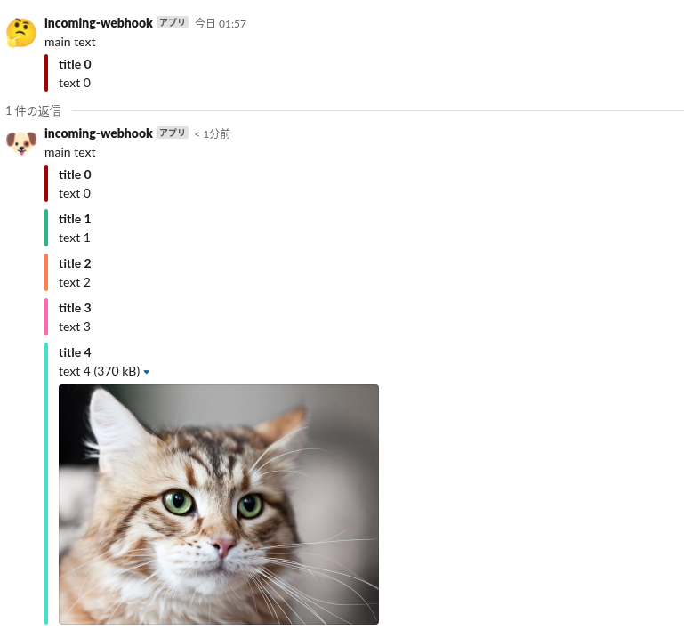

# Slack-Tools
this is simple message tool using slackweb

# usage

### notify
post simple message
```
python slack.py notify 'notify message !'
```


### send 
post payload including only 1 attachments
```
python slack.py send 'send message' --color 'warning' --title 'sample title'
```


### write
make json file that contains attachment
```
python slack.py write_attachment --color 'danger' --title 'title 0' --text 'text 0'
python slack.py write_attachment -n 1 --color 'good' --title 'title 1' --text 'text 1'
python slack.py write_attachment -n 2 --color '#ff7f50' --title 'title 2' --text 'text 2'
python slack.py write_attachment -n 3 --color '#ff69b4' --title 'title 3' --text 'text 3'
python slack.py write_attachment -n 4 --color '#40e0d0' --title 'title 4' --text 'text 4' --image_url 'http://t2.gstatic.com/licensed-image?q=tbn:ANd9GcQuELPI1RkmBQ8W5DF-ewyV-e6dIePOCzpZ2OnuBB1hipBi6woum_ktchntjF9_mGoziP0ZZnKmGtAK_054J4k'
```

### show 
show json files you made with write api

show attachment_4 json file
```
python slack.py show_attachments -n 4
# {'color': '#40e0d0', 'title': 'title 4', 'text': 'text 4', 'image_url': 'http://t2.gstatic.com/licensed-image?q=tbn:ANd9GcQuELPI1RkmBQ8W5DF-ewyV-e6dIePOCzpZ2OnuBB1hipBi6woum_ktchntjF9_mGoziP0ZZnKmGtAK_054J4k'}
```

show from attachment_0 to attachment_4 json files 
```
python slack.py show_attachments
# {'color': 'danger', 'title': 'title 0', 'text': 'text 0', 'image_url': ''}
# {'color': 'good', 'title': 'title 1', 'text': 'text 1', 'image_url': ''}
# {'color': '#ff7f50', 'title': 'title 2', 'text': 'text 2', 'image_url': ''}
# {'color': '#ff69b4', 'title': 'title 3', 'text': 'text 3', 'image_url': ''}
# {'color': '#40e0d0', 'title': 'title 4', 'text': 'text 4', 'image_url': 'http://t2.gstatic.com/licensed-image?q=tbn:ANd9GcQuELPI1RkmBQ8W5DF-ewyV-e6dIePOCzpZ2OnuBB1hipBi6woum_ktchntjF9_mGoziP0ZZnKmGtAK_054J4k'}
```

### send_attachments
send payload including attachments you made
```
python slack.py send_attachments -n 0 --text 'main text' --icon_emoji ':thinking_face:' 
python slack.py send_attachments -n 4 --text 'main text' --icon_emoji ':dog:' --thread_ts '1623689860.002100'
```

